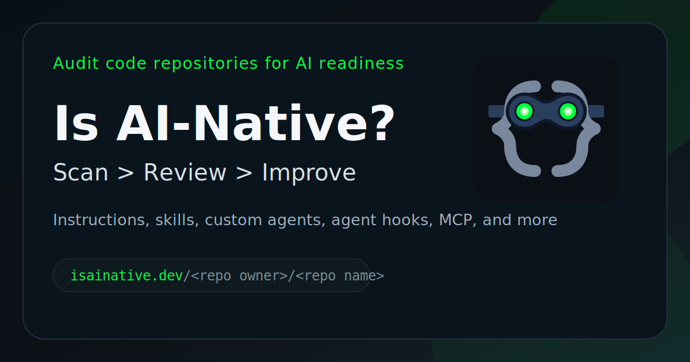

# 🤖 Is it AI-Native?



Scan any GitHub repository for AI-native development primitives through the hosted web app, the VS Code extension, the GitHub CLI extension, or the standalone CLI.

Is it AI-Native inspects a repository's file tree and checks for AI-native development primitives across **GitHub Copilot**, **Claude Code**, and **OpenAI Codex**. Every surface uses the same shared scan engine and scoring model, so browser, editor, and CLI results stay aligned.

Available surfaces:

- **Web app** for browser-based scans, shared reports, and WebMCP preview support
- **VS Code extension** in [packages/vscode-extension/README.md](packages/vscode-extension/README.md)
- **GitHub CLI extension** in [packages/gh-extension/README.md](packages/gh-extension/README.md)
- **Standalone CLI** in [packages/cli/README.md](packages/cli/README.md)

| Verdict | Strongest Assistant Score |
| --- | --- |
| **AI-Native** | ≥ 60 % |
| **AI-Assisted** | 30 – 59 % |
| **Traditional** | < 30 % |

## Overview

- **Repository inputs**: GitHub repository URLs, `owner/repo` references, or local workspaces depending on the surface you use
- **Assistant coverage**: GitHub Copilot, Claude Code, and OpenAI Codex
- **Primitive categories**: Instructions, Prompts, Agents, Skills, MCP Config, and Agent Hooks
- **Result shape**: overall score, verdict, preferred assistant, per-assistant breakdown, and primitive-level matches

## Common Features

- **Shared scan engine** across the web app, VS Code extension, GitHub CLI extension, and standalone CLI
- **Configuration-driven detection** through JSON assistant and primitive definitions in [docs/configuration.md](docs/configuration.md)
- **Per-assistant scoring** with an overall verdict based on the strongest assistant score
- **GitHub API token support** for higher rate limits on repeated remote scans
- **Weekly maintenance automation** that reviews assistant-related configuration drift before proposing minimal draft PRs

> [!IMPORTANT]
> **Repo-maintained AI skills power this project.**
> This application uses the **WebMCP** and **GitHub Agentic Workflows** skills maintained in the companion [webmaxru/agent-skills](https://github.com/webmaxru/agent-skills/) repository.
>
> Skills currently exposed by the `agent-skills` repo:
> - **Agent Package Manager**
> - **GitHub Agentic Workflows**
> - **Language Detector API**
> - **Prompt API**
> - **Proofreader API**
> - **Translator API**
> - **WebMCP**
> - **WebNN**
> - **Writing Assistance APIs**
>
> These skills are reviewed regularly and manually validated before changes are relied on in the app's workflows, scanner maintenance, and supporting automation.

## Web App

The web app is the primary browser-based surface. It provides the quickest path for scanning public GitHub repositories without installing editor or terminal tooling.

Web app capabilities:

- **Browser-based scanning** backed by the shared repository scan engine
- **Shareable reports** under `/_/report/<uuid>` with 90-day expiry when sharing is enabled
- **WebMCP preview** in Chromium-based browsers when `about://flags/#enable-webmcp-testing` is enabled
- **Single-container hosting model** where Express serves both the SPA and the API

WebMCP preview tools:

- `scan_repository` via `navigator.modelContext.registerTool(...)`
- `scan_repository_form` via the annotated repo scan form

Architecture:

```text
┌──────────────┐        ┌────────────────┐
│   Browser    │──3000─▶│ Express App     │
│  (SPA)       │        │ SPA + API       │
└──────────────┘        └───────┬────────┘
                                │
                       ┌────────▼────────┐
                       │  GitHub API     │
                       │  (repo scan)    │
                       └────────┬────────┘
                                │
                       ┌────────▼──────────────┐
                       │  File-backed report   │
                       │  store (optional)     │
                       │  for shared reports   │
                       └───────────────────────┘
```

## Related Components

Use the component-specific READMEs for installation and usage details outside the browser:

- [packages/vscode-extension/README.md](packages/vscode-extension/README.md)
- [packages/gh-extension/README.md](packages/gh-extension/README.md)
- [packages/cli/README.md](packages/cli/README.md)
- [docs/configuration.md](docs/configuration.md) for assistant and primitive configuration

## API Reference

### `POST /api/scan`

Scan a GitHub repository.

**Request body:**

```json
{ "repo_url": "https://github.com/owner/repo", "branch": "main" }
```

`branch` is optional. The response includes the scan result plus metadata such as the scanned branch, source, and `paths_scanned`.

### `GET /api/config`

Returns server configuration flags.

**Response:**

```json
{ "sharingEnabled": false }
```

### `POST /api/report`

Save a scan result for sharing when `ENABLE_SHARING=true`.

**Request body:**

```json
{ "result": { /* scan result object */ } }
```

**Response:**

```json
{ "id": "uuid", "url": "/_/report/uuid" }
```

### `GET /api/report/:id`

Retrieve a shared report by ID when `ENABLE_SHARING=true`.

### `GET /api/health`

Health check endpoint returning only the runtime capability flags needed for liveness checks and lightweight diagnostics: scan token availability, report sharing status, and Application Insights telemetry status.

## Supporting Automation

The repository includes a GitHub Agentic Workflow at [`.github/workflows/weekly-assistant-config-review.md`](.github/workflows/weekly-assistant-config-review.md) to keep supporting skills, prompts, and scanner configuration aligned with current assistant platform documentation.

The workflow:

- fetches vendor documentation sources listed in [docs/configuration.md](docs/configuration.md)
- compares them against the current repository-scoped assistant model
- narrows detected drift to the smallest justified change set
- creates a draft PR instead of merging directly

## Cloud Deployment (Azure)

The web app is designed to run on **Azure Container Apps** on the Consumption plan.

### Infrastructure as Code

All Azure resources are defined in [infra/main.bicep](infra/main.bicep) with defaults in [infra/main.bicepparam](infra/main.bicepparam).

| Resource | Purpose |
| --- | --- |
| **Log Analytics Workspace** | Centralized logs and diagnostics |
| **Application Insights** | Scan, report, view, and rate-limit telemetry |
| **Shared Azure Workbook** | Growth and engagement dashboard over page views, sessions, CTA clicks, shares, and report activity |
| **Container Apps Environment** | Consumption-plan hosting environment |
| **Container App** | Web app runtime with probes, autoscaling, and managed identity |
| **Azure Storage Account + File Share** | Optional persistence for shared reports |
| **Action Group + Availability Test + Alert Rule** | Optional email alerting for site availability |

Optional deployment features:

- `acrName` for Azure Container Registry image pulls
- `customDomainName` and `managedCertName` for managed TLS on a custom hostname
- `secondaryCustomDomainName` and `secondaryManagedCertName` for dual-hostname migrations
- `monitoringAlertEmail` and `monitoringUrl` for low-cost availability monitoring
- `enableEngagementWorkbook=false` if you need to skip workbook deployment while keeping Application Insights enabled

Container scale settings are configured in infrastructure, not via the public API:

- For manual deployments, set `containerStartupStrategy` in [infra/main.bicepparam](infra/main.bicepparam) or pass `--parameters containerStartupStrategy=keep-warm` when running `az deployment group create`.
- For the GitHub Actions production deployment, set the inline `containerStartupStrategy=...` override in [.github/workflows/cd.yml](.github/workflows/cd.yml).
- `minReplicas` is derived from `containerStartupStrategy` in [infra/main.bicep](infra/main.bicep).
- `maxReplicas` is set directly in the `template.scale.maxReplicas` block in [infra/main.bicep](infra/main.bicep).

### CI / CD Pipelines

| Workflow | File | Trigger | Purpose |
| --- | --- | --- | --- |
| **CI** | `.github/workflows/ci.yml` | Push to non-main branches, PRs to `main` | Test, build image, run Trivy scan, upload SARIF |
| **CD** | `.github/workflows/cd.yml` | Push to `main` | Build and push image, run Trivy, deploy to Azure via OIDC |

### Azure Workbook Monitoring

The main Azure deployment now provisions the shared workbook automatically whenever `enableAppInsights=true` and `enableEngagementWorkbook=true`.

The workbook combines workspace-based `AppPageViews` and `AppEvents` telemetry so you can monitor promo traffic and product engagement in one place. Primary custom event names now include:

- `cta_clicked_client`
- `landing_section_viewed_client`
- `outbound_doc_link_clicked_client`
- `scan_requested_client`
- `scan_succeeded_client`
- `scan_completed`
- `scan_failed`
- `report_created`
- `report_share_requested_client`
- `report_shared_client`
- `shared_report_viewed`

Use the workspace-based `AppPageViews` and `AppEvents` tables for workbook queries.

To deploy the workbook by itself into an existing resource group and workspace, run:

```powershell
$resourceGroup = '<resource-group>'
$workspaceId = az monitor log-analytics workspace show --resource-group $resourceGroup --workspace-name is-ai-native-logs --query id -o tsv
az deployment group create --resource-group $resourceGroup --template-file infra/workbooks/is-ai-native-monitoring.workbook.bicep --parameters workbookSourceId=$workspaceId
```

To deploy the full stack, including the workbook, with the repo defaults, run:

```powershell
az deployment group create --resource-group <resource-group> --template-file infra/main.bicep --parameters @infra/main.bicepparam --parameters containerImage=<image> githubToken=<token>
```

## Development And Local Deployment

### Prerequisites

| Tool | Version | Required for |
| --- | --- | --- |
| [Node.js](https://nodejs.org/) | 24+ | Backend development and tests |
| [Docker](https://www.docker.com/) | 20+ | Container builds |
| [Docker Compose](https://docs.docker.com/compose/) | v2+ | Full-stack local run |
| [Azure CLI](https://learn.microsoft.com/cli/azure/) | 2.x | Manual Azure deployment |

### Local Development

#### Backend Only

```powershell
cd webapp/backend
npm install
npm run dev
```

The API runs at `http://localhost:3000`.

#### Full Stack Without Docker

```powershell
cd webapp/backend
npm install
npm run dev:full
```

This serves the SPA from `webapp/frontend/` on the same origin as the API.

#### Full Stack With Docker Compose

```powershell
docker compose up --build
```

Stop it with:

```powershell
docker compose down
```

#### Single Container

```powershell
docker build -t is-ai-native .
docker run -p 3000:3000 -e NODE_ENV=production is-ai-native
```

### Testing

Backend tests:

```powershell
cd webapp/backend
npm install
npm test
npm run test:unit
npm run test:contract
npm run test:integration
```

Workspace tests:

```powershell
npm install
npm run test:frontend
npm run test:core
npm run test:cli
npm run test:gh-extension
npm run test:vscode-extension
npm run build:cli
npm run build:vscode-extension
```

### Environment Variables

| Variable | Default | Description |
| --- | --- | --- |
| `PORT` | `3000` | Express server port |
| `NODE_ENV` | — | Set to `production` in deployed environments |
| `GH_TOKEN_FOR_SCAN` | — | GitHub PAT for higher scan API rate limits |
| `ENABLE_SHARING` | `false` | Enable shared reports |
| `APPLICATIONINSIGHTS_CONNECTION_STRING` | — | Server-side Application Insights connection string |
| `PUBLIC_APPLICATIONINSIGHTS_CONNECTION_STRING` | `APPLICATIONINSIGHTS_CONNECTION_STRING` | Frontend telemetry connection string |
| `REPORTS_DIR` | `./data/reports` | Shared report storage directory |
| `FRONTEND_PATH` | unset | Path to a source-checkout frontend directory |
| `TRUST_PROXY` | `1` in production, otherwise `false` | Express trust proxy setting |
| `SCAN_RATE_LIMIT_WINDOW_MS` | `900000` | `/api/scan` rate-limit window |
| `SCAN_RATE_LIMIT_MAX` | `120` | `/api/scan` rate-limit max requests |
| `REPORT_RATE_LIMIT_WINDOW_MS` | `900000` | `/api/report` rate-limit window |
| `REPORT_RATE_LIMIT_MAX` | `240` | `/api/report` rate-limit max unsafe requests |
| `ALLOWED_ORIGIN` | `false` | Allowed CORS origin |
| `SITE_ORIGIN` | unset | Public base URL for canonical tags and social cards |
| `SITE_NAME` | `IsAINative` | Product name used in structured data and manifest |
| `SITE_SHORT_NAME` | `SITE_NAME` | Short product name used in the manifest |
| `DEFAULT_PAGE_TITLE` | built-in default | Homepage title |
| `DEFAULT_META_DESCRIPTION` | built-in default | Homepage meta description |
| `TWITTER_HANDLE` | unset | Optional social card handle |
| `ALLOW_SITE_INDEXING` | `true` in production, otherwise `false` | Search indexing control |

### Project Structure

```text
├── webapp/
│   ├── backend/
│   └── frontend/
├── packages/
│   ├── core/
│   ├── cli/
│   ├── gh-extension/
│   └── vscode-extension/
├── infra/
├── docs/
├── .github/
├── Dockerfile
├── docker-compose.yml
└── README.md
```

## License

This project is licensed under the [MIT License](LICENSE).
