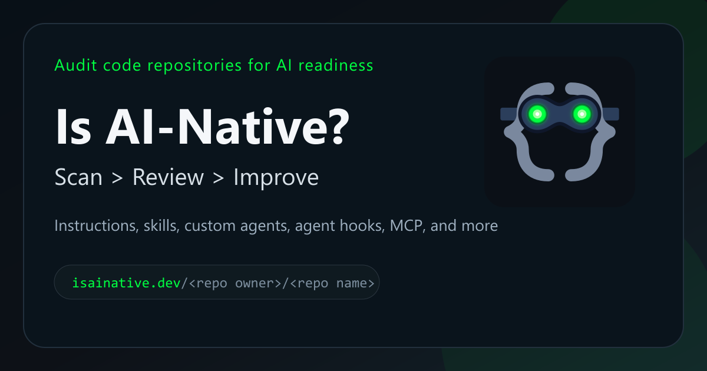

# gh-is-ai-native



GitHub CLI extension for scanning local repositories and GitHub repositories for AI-native development primitives.

This folder contains the source-of-truth assets and export tooling for the generated `gh-is-ai-native` repository. The standalone `is-ai-native` CLI lives in `../cli/` and is bundled into the generated extension.

## Install

```bash
gh extension install webmaxru/gh-is-ai-native
```

On Windows, GitHub CLI runs script-based extensions through `sh.exe`. Install Git for Windows if `gh` reports that `sh.exe` is missing.

This extension requires Node.js 22 or newer because the generated launcher executes a bundled Node runtime entrypoint.

## Build Export From Workspace

From the repository root:

```powershell
npm install
npm run build:gh-extension
npm run test:gh-extension
```

This writes a standalone script-based GitHub CLI extension layout to `artifacts/gh-extension/repo` with:

- a root launcher named `gh-is-ai-native`
- a bundled Node entrypoint named `gh-is-ai-native.mjs`
- a bundled `config/` directory copied from `packages/core/config`
- a branded `assets/brand/` directory with the extension icon and social card
- a dedicated extension README and the project license

For the normal coordinated release path, run this from the repository root:

```powershell
npm run release:all -- 0.1.4 --publish --push
```

That command aligns the GitHub CLI extension version with the standalone CLI and VS Code extension, rebuilds the export artifact, and syncs the generated repository by invoking `npm run publish:gh-extension`.

If you need to sync the generated extension repository directly, make sure `GH_EXTENSION_REPOSITORY` and `GH_EXTENSION_SYNC_TOKEN` are set, then run:

```powershell
npm run publish:gh-extension
```

## Usage

```bash
gh is-ai-native scan [target] [--output human|json|csv|summary] [--branch <branch>] [--token <token>] [--fail-below <score>]
```

If `target` is omitted, the extension scans the current workspace.

Examples:

```bash
gh is-ai-native scan
gh is-ai-native scan .
gh is-ai-native scan microsoft/vscode --output summary
gh is-ai-native scan https://github.com/microsoft/vscode --branch main
gh is-ai-native scan . --output summary --fail-below 60
```

## Output Modes

- `human`: default readable console report with a preferred-agent headline plus full per-assistant detail
- `json`: full structured scan result
- `csv`: one row per primitive
- `summary`: one-line CI-friendly output based on the preferred agent

## Exit Codes

- `0`: success
- `1`: usage or runtime error
- `2`: scan completed, but the score was below `--fail-below`

## Authentication

For remote GitHub scans, token resolution order is:

1. `--token`
2. `GITHUB_TOKEN`
3. `GH_TOKEN_FOR_SCAN`

## Source of Truth

This repository is generated from `packages/cli`, `packages/gh-extension`, and `packages/core` in the main `is-ai-native` workspace. Do not edit generated files here manually unless you also update the source workspace.